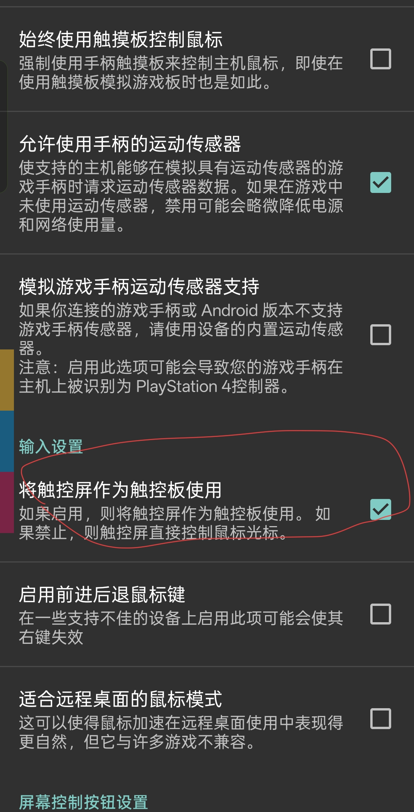
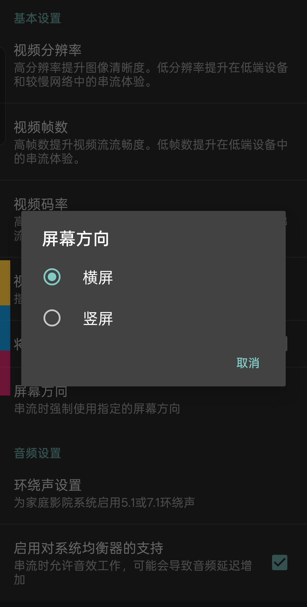
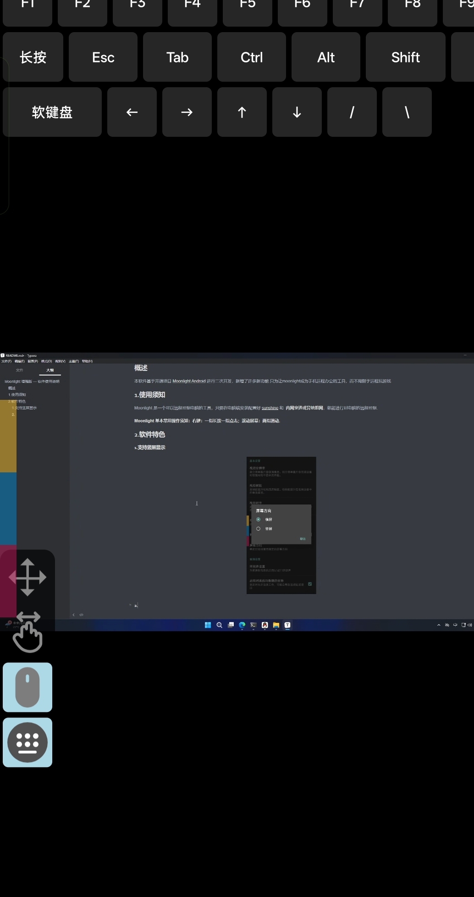
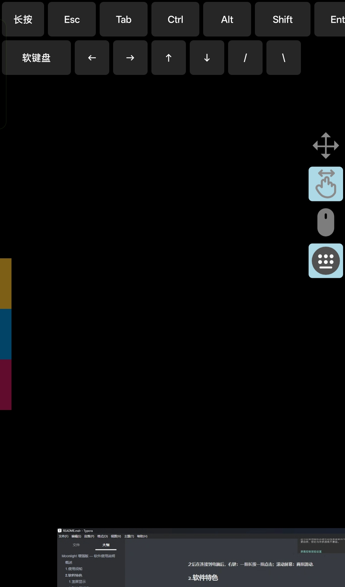
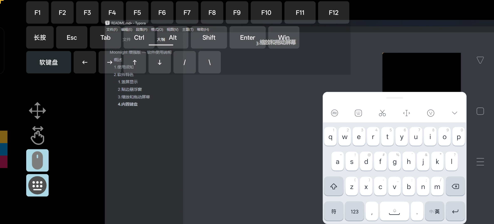

# Moonlight 增强版 — 软件使用说明

## 概述

本软件基于开源项目 [Moonlight Android](https://github.com/moonlight-stream/moonlight-android) 进行二次开发，新增了许多新功能.只为让moonlight成为手机远程办公的工具，而不局限于远程玩游戏.

## 1.使用须知

Moonlight 是一个可以远程控制电脑的工具，只要在电脑端安装配置好 [sunshine](https://app.lizardbyte.dev/Sunshine/?lng=zh-CN) 和  **内网穿透或异地组网**，就能进行对电脑的远程控制.

PS.内网穿透需要的条件比较苛刻，建议异地组网，但是异地组网要打开tcp和udo双端.

**Moonlight 基本常用操作须知：**

在输入设置中打开如图的配置

**之后在连接到电脑后，右键：一指长按一指点击；滚动屏幕：两指滑动.**

## 2.软件特色

### 1.竖屏显示

### 2.贴边悬浮窗

拖动悬浮窗第一个按钮可以移动悬浮窗，悬浮窗自动贴边.

### 3.缩放和拖动屏幕

点击悬浮窗第2个按钮操作屏幕，二指缩放，单指拖动.双击屏幕恢复到初始状态.

点击悬浮窗第3个按钮可以恢复鼠标操作.

### 4.内置键盘

点击悬浮窗第4个按钮可以打开键盘，再次点击关闭键盘.

### 5.短线重连

moonlight原版有一个很抽象的问题，切出软件一段时间后需要手动重连，现在这个问题已经解决，并且重连会恢复 屏幕缩放、屏幕位置、悬浮窗状态、键盘状态.
